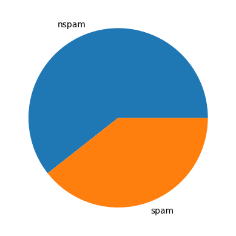
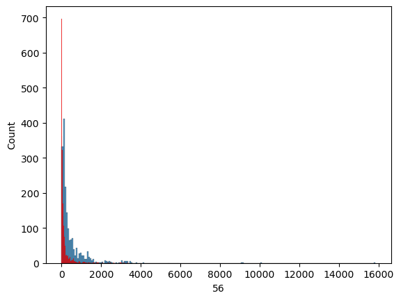
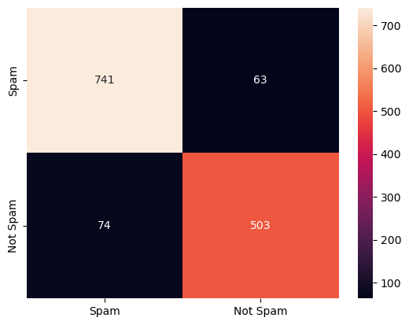

.. code:: ipython3

    import numpy as np
    import pandas as pd
    
    df=pd.read_csv('spambase.data', header=None)
    df

.. raw:: html

    

    
    <table border="1" class="dataframe">
      <thead>
        <tr style="text-align: right;">
          <th></th>
          <th>0</th>
          <th>1</th>
          <th>2</th>
          <th>3</th>
          <th>4</th>
          <th>5</th>
          <th>6</th>
          <th>7</th>
          <th>8</th>
          <th>9</th>
          <th>...</th>
          <th>48</th>
          <th>49</th>
          <th>50</th>
          <th>51</th>
          <th>52</th>
          <th>53</th>
          <th>54</th>
          <th>55</th>
          <th>56</th>
          <th>57</th>
        </tr>
      </thead>
      <tbody>
        <tr>
          <th>0</th>
          <td>0.00</td>
          <td>0.64</td>
          <td>0.64</td>
          <td>0.0</td>
          <td>0.32</td>
          <td>0.00</td>
          <td>0.00</td>
          <td>0.00</td>
          <td>0.00</td>
          <td>0.00</td>
          <td>...</td>
          <td>0.000</td>
          <td>0.000</td>
          <td>0.0</td>
          <td>0.778</td>
          <td>0.000</td>
          <td>0.000</td>
          <td>3.756</td>
          <td>61</td>
          <td>278</td>
          <td>1</td>
        </tr>
        <tr>
          <th>1</th>
          <td>0.21</td>
          <td>0.28</td>
          <td>0.50</td>
          <td>0.0</td>
          <td>0.14</td>
          <td>0.28</td>
          <td>0.21</td>
          <td>0.07</td>
          <td>0.00</td>
          <td>0.94</td>
          <td>...</td>
          <td>0.000</td>
          <td>0.132</td>
          <td>0.0</td>
          <td>0.372</td>
          <td>0.180</td>
          <td>0.048</td>
          <td>5.114</td>
          <td>101</td>
          <td>1028</td>
          <td>1</td>
        </tr>
        <tr>
          <th>2</th>
          <td>0.06</td>
          <td>0.00</td>
          <td>0.71</td>
          <td>0.0</td>
          <td>1.23</td>
          <td>0.19</td>
          <td>0.19</td>
          <td>0.12</td>
          <td>0.64</td>
          <td>0.25</td>
          <td>...</td>
          <td>0.010</td>
          <td>0.143</td>
          <td>0.0</td>
          <td>0.276</td>
          <td>0.184</td>
          <td>0.010</td>
          <td>9.821</td>
          <td>485</td>
          <td>2259</td>
          <td>1</td>
        </tr>
        <tr>
          <th>3</th>
          <td>0.00</td>
          <td>0.00</td>
          <td>0.00</td>
          <td>0.0</td>
          <td>0.63</td>
          <td>0.00</td>
          <td>0.31</td>
          <td>0.63</td>
          <td>0.31</td>
          <td>0.63</td>
          <td>...</td>
          <td>0.000</td>
          <td>0.137</td>
          <td>0.0</td>
          <td>0.137</td>
          <td>0.000</td>
          <td>0.000</td>
          <td>3.537</td>
          <td>40</td>
          <td>191</td>
          <td>1</td>
        </tr>
        <tr>
          <th>4</th>
          <td>0.00</td>
          <td>0.00</td>
          <td>0.00</td>
          <td>0.0</td>
          <td>0.63</td>
          <td>0.00</td>
          <td>0.31</td>
          <td>0.63</td>
          <td>0.31</td>
          <td>0.63</td>
          <td>...</td>
          <td>0.000</td>
          <td>0.135</td>
          <td>0.0</td>
          <td>0.135</td>
          <td>0.000</td>
          <td>0.000</td>
          <td>3.537</td>
          <td>40</td>
          <td>191</td>
          <td>1</td>
        </tr>
        <tr>
          <th>...</th>
          <td>...</td>
          <td>...</td>
          <td>...</td>
          <td>...</td>
          <td>...</td>
          <td>...</td>
          <td>...</td>
          <td>...</td>
          <td>...</td>
          <td>...</td>
          <td>...</td>
          <td>...</td>
          <td>...</td>
          <td>...</td>
          <td>...</td>
          <td>...</td>
          <td>...</td>
          <td>...</td>
          <td>...</td>
          <td>...</td>
          <td>...</td>
        </tr>
        <tr>
          <th>4596</th>
          <td>0.31</td>
          <td>0.00</td>
          <td>0.62</td>
          <td>0.0</td>
          <td>0.00</td>
          <td>0.31</td>
          <td>0.00</td>
          <td>0.00</td>
          <td>0.00</td>
          <td>0.00</td>
          <td>...</td>
          <td>0.000</td>
          <td>0.232</td>
          <td>0.0</td>
          <td>0.000</td>
          <td>0.000</td>
          <td>0.000</td>
          <td>1.142</td>
          <td>3</td>
          <td>88</td>
          <td>0</td>
        </tr>
        <tr>
          <th>4597</th>
          <td>0.00</td>
          <td>0.00</td>
          <td>0.00</td>
          <td>0.0</td>
          <td>0.00</td>
          <td>0.00</td>
          <td>0.00</td>
          <td>0.00</td>
          <td>0.00</td>
          <td>0.00</td>
          <td>...</td>
          <td>0.000</td>
          <td>0.000</td>
          <td>0.0</td>
          <td>0.353</td>
          <td>0.000</td>
          <td>0.000</td>
          <td>1.555</td>
          <td>4</td>
          <td>14</td>
          <td>0</td>
        </tr>
        <tr>
          <th>4598</th>
          <td>0.30</td>
          <td>0.00</td>
          <td>0.30</td>
          <td>0.0</td>
          <td>0.00</td>
          <td>0.00</td>
          <td>0.00</td>
          <td>0.00</td>
          <td>0.00</td>
          <td>0.00</td>
          <td>...</td>
          <td>0.102</td>
          <td>0.718</td>
          <td>0.0</td>
          <td>0.000</td>
          <td>0.000</td>
          <td>0.000</td>
          <td>1.404</td>
          <td>6</td>
          <td>118</td>
          <td>0</td>
        </tr>
        <tr>
          <th>4599</th>
          <td>0.96</td>
          <td>0.00</td>
          <td>0.00</td>
          <td>0.0</td>
          <td>0.32</td>
          <td>0.00</td>
          <td>0.00</td>
          <td>0.00</td>
          <td>0.00</td>
          <td>0.00</td>
          <td>...</td>
          <td>0.000</td>
          <td>0.057</td>
          <td>0.0</td>
          <td>0.000</td>
          <td>0.000</td>
          <td>0.000</td>
          <td>1.147</td>
          <td>5</td>
          <td>78</td>
          <td>0</td>
        </tr>
        <tr>
          <th>4600</th>
          <td>0.00</td>
          <td>0.00</td>
          <td>0.65</td>
          <td>0.0</td>
          <td>0.00</td>
          <td>0.00</td>
          <td>0.00</td>
          <td>0.00</td>
          <td>0.00</td>
          <td>0.00</td>
          <td>...</td>
          <td>0.000</td>
          <td>0.000</td>
          <td>0.0</td>
          <td>0.125</td>
          <td>0.000</td>
          <td>0.000</td>
          <td>1.250</td>
          <td>5</td>
          <td>40</td>
          <td>0</td>
        </tr>
      </tbody>
    </table>
    
4601 rows × 58 columns

    

.. code:: ipython3

    df[57].value_counts()

.. parsed-literal::

    57
    0    2788
    1    1813
    Name: count, dtype: int64

.. code:: ipython3

    import matplotlib.pyplot as plt
    plt.pie(df[57].value_counts(), labels=['nspam','spam'])

.. parsed-literal::

    ([<matplotlib.patches.Wedge at 0x2527f379790>,
      <matplotlib.patches.Wedge at 0x2527f222890>],
     [Text(-0.3594306573832482, 1.0396199317698012, 'nspam'),
      Text(0.3594307547194897, -1.0396198981174698, 'spam')])

**#data is balanced**

.. code:: ipython3

    #54 is capital_run_length_average
    #55 is capital_run_length_longest
    #56 is capital_run_length_total
    
    df.iloc[:, 54:57].describe()

.. raw:: html

    

    
    <table border="1" class="dataframe">
      <thead>
        <tr style="text-align: right;">
          <th></th>
          <th>54</th>
          <th>55</th>
          <th>56</th>
        </tr>
      </thead>
      <tbody>
        <tr>
          <th>count</th>
          <td>4601.000000</td>
          <td>4601.000000</td>
          <td>4601.000000</td>
        </tr>
        <tr>
          <th>mean</th>
          <td>5.191515</td>
          <td>52.172789</td>
          <td>283.289285</td>
        </tr>
        <tr>
          <th>std</th>
          <td>31.729449</td>
          <td>194.891310</td>
          <td>606.347851</td>
        </tr>
        <tr>
          <th>min</th>
          <td>1.000000</td>
          <td>1.000000</td>
          <td>1.000000</td>
        </tr>
        <tr>
          <th>25%</th>
          <td>1.588000</td>
          <td>6.000000</td>
          <td>35.000000</td>
        </tr>
        <tr>
          <th>50%</th>
          <td>2.276000</td>
          <td>15.000000</td>
          <td>95.000000</td>
        </tr>
        <tr>
          <th>75%</th>
          <td>3.706000</td>
          <td>43.000000</td>
          <td>266.000000</td>
        </tr>
        <tr>
          <th>max</th>
          <td>1102.500000</td>
          <td>9989.000000</td>
          <td>15841.000000</td>
        </tr>
      </tbody>
    </table>
    

.. code:: ipython3

    #for non spam emails
    df[df[57]==0].iloc[:,54:57].describe()

.. raw:: html

    

    
    <table border="1" class="dataframe">
      <thead>
        <tr style="text-align: right;">
          <th></th>
          <th>54</th>
          <th>55</th>
          <th>56</th>
        </tr>
      </thead>
      <tbody>
        <tr>
          <th>count</th>
          <td>2788.000000</td>
          <td>2788.000000</td>
          <td>2788.000000</td>
        </tr>
        <tr>
          <th>mean</th>
          <td>2.377301</td>
          <td>18.214491</td>
          <td>161.470947</td>
        </tr>
        <tr>
          <th>std</th>
          <td>5.113685</td>
          <td>39.084792</td>
          <td>355.738403</td>
        </tr>
        <tr>
          <th>min</th>
          <td>1.000000</td>
          <td>1.000000</td>
          <td>1.000000</td>
        </tr>
        <tr>
          <th>25%</th>
          <td>1.384000</td>
          <td>4.000000</td>
          <td>18.750000</td>
        </tr>
        <tr>
          <th>50%</th>
          <td>1.857000</td>
          <td>10.000000</td>
          <td>54.000000</td>
        </tr>
        <tr>
          <th>75%</th>
          <td>2.555000</td>
          <td>18.000000</td>
          <td>141.000000</td>
        </tr>
        <tr>
          <th>max</th>
          <td>251.000000</td>
          <td>1488.000000</td>
          <td>5902.000000</td>
        </tr>
      </tbody>
    </table>
    

.. code:: ipython3

    #for spam emails
    df[df[57]==1].iloc[:,54:57].describe()

.. raw:: html

    

    
    <table border="1" class="dataframe">
      <thead>
        <tr style="text-align: right;">
          <th></th>
          <th>54</th>
          <th>55</th>
          <th>56</th>
        </tr>
      </thead>
      <tbody>
        <tr>
          <th>count</th>
          <td>1813.000000</td>
          <td>1813.000000</td>
          <td>1813.000000</td>
        </tr>
        <tr>
          <th>mean</th>
          <td>9.519165</td>
          <td>104.393271</td>
          <td>470.619415</td>
        </tr>
        <tr>
          <th>std</th>
          <td>49.846186</td>
          <td>299.284969</td>
          <td>825.081179</td>
        </tr>
        <tr>
          <th>min</th>
          <td>1.000000</td>
          <td>1.000000</td>
          <td>2.000000</td>
        </tr>
        <tr>
          <th>25%</th>
          <td>2.324000</td>
          <td>15.000000</td>
          <td>93.000000</td>
        </tr>
        <tr>
          <th>50%</th>
          <td>3.621000</td>
          <td>38.000000</td>
          <td>194.000000</td>
        </tr>
        <tr>
          <th>75%</th>
          <td>5.708000</td>
          <td>84.000000</td>
          <td>530.000000</td>
        </tr>
        <tr>
          <th>max</th>
          <td>1102.500000</td>
          <td>9989.000000</td>
          <td>15841.000000</td>
        </tr>
      </tbody>
    </table>
    

#capital_run_length_average,capital_run_length_longest,capital_run_length_total
is less for non spam and more for spam emails.

.. code:: ipython3

    import seaborn as sns
    sns.histplot(df[df[57]==1][56])
    sns.histplot(df[df[57]==0][56], color='red')

.. parsed-literal::

    <Axes: xlabel='56', ylabel='Count'>

.. code:: ipython3

    df.info()

.. parsed-literal::

    <class 'pandas.core.frame.DataFrame'>
    RangeIndex: 4601 entries, 0 to 4600
    Data columns (total 58 columns):
     #   Column  Non-Null Count  Dtype  
    ---  ------  --------------  -----  
     0   0       4601 non-null   float64
     1   1       4601 non-null   float64
     2   2       4601 non-null   float64
     3   3       4601 non-null   float64
     4   4       4601 non-null   float64
     5   5       4601 non-null   float64
     6   6       4601 non-null   float64
     7   7       4601 non-null   float64
     8   8       4601 non-null   float64
     9   9       4601 non-null   float64
     10  10      4601 non-null   float64
     11  11      4601 non-null   float64
     12  12      4601 non-null   float64
     13  13      4601 non-null   float64
     14  14      4601 non-null   float64
     15  15      4601 non-null   float64
     16  16      4601 non-null   float64
     17  17      4601 non-null   float64
     18  18      4601 non-null   float64
     19  19      4601 non-null   float64
     20  20      4601 non-null   float64
     21  21      4601 non-null   float64
     22  22      4601 non-null   float64
     23  23      4601 non-null   float64
     24  24      4601 non-null   float64
     25  25      4601 non-null   float64
     26  26      4601 non-null   float64
     27  27      4601 non-null   float64
     28  28      4601 non-null   float64
     29  29      4601 non-null   float64
     30  30      4601 non-null   float64
     31  31      4601 non-null   float64
     32  32      4601 non-null   float64
     33  33      4601 non-null   float64
     34  34      4601 non-null   float64
     35  35      4601 non-null   float64
     36  36      4601 non-null   float64
     37  37      4601 non-null   float64
     38  38      4601 non-null   float64
     39  39      4601 non-null   float64
     40  40      4601 non-null   float64
     41  41      4601 non-null   float64
     42  42      4601 non-null   float64
     43  43      4601 non-null   float64
     44  44      4601 non-null   float64
     45  45      4601 non-null   float64
     46  46      4601 non-null   float64
     47  47      4601 non-null   float64
     48  48      4601 non-null   float64
     49  49      4601 non-null   float64
     50  50      4601 non-null   float64
     51  51      4601 non-null   float64
     52  52      4601 non-null   float64
     53  53      4601 non-null   float64
     54  54      4601 non-null   float64
     55  55      4601 non-null   int64  
     56  56      4601 non-null   int64  
     57  57      4601 non-null   int64  
    dtypes: float64(55), int64(3)
    memory usage: 2.0 MB
    

#there are no empty values in the table

.. code:: ipython3

    X = df.iloc[:,:-1]
    y = df.iloc[:,-1]

.. code:: ipython3

    from sklearn.model_selection import train_test_split
    X_train,X_test,y_train,y_test = train_test_split(X,y,test_size=0.3,random_state=42)

.. code:: ipython3

    from sklearn.linear_model import LogisticRegression

.. code:: ipython3

    clf = LogisticRegression(max_iter=5000)
    clf.fit(X_train,y_train)

.. raw:: html

    

<pre>LogisticRegression(max_iter=5000)</pre><b>In a Jupyter environment, please rerun this cell to show the HTML representation or trust the notebook.  On GitHub, the HTML representation is unable to render, please try loading this page with nbviewer.org.</b>

<input class="sk-toggleable__control sk-hidden--visually" id="sk-estimator-id-10" type="checkbox" checked><label for="sk-estimator-id-10" class="sk-toggleable__label sk-toggleable__label-arrow">LogisticRegression</label>
<pre>LogisticRegression(max_iter=5000)</pre>

.. code:: ipython3

    y_pred = clf.predict(X_test)
    from sklearn.metrics import accuracy_score,classification_report
    accuracy_score(y_test,y_pred)

.. parsed-literal::

    0.9319333816075308

.. code:: ipython3

    print(classification_report(y_test,y_pred))

.. parsed-literal::

                  precision    recall  f1-score   support
    
               0       0.93      0.96      0.94       804
               1       0.94      0.90      0.92       577
    
        accuracy                           0.93      1381
       macro avg       0.93      0.93      0.93      1381
    weighted avg       0.93      0.93      0.93      1381
    
    

.. code:: ipython3

    from sklearn.naive_bayes import GaussianNB
    gnb = GaussianNB()
    gnb.fit(X_train, y_train)

.. raw:: html

    

<pre>GaussianNB()</pre><b>In a Jupyter environment, please rerun this cell to show the HTML representation or trust the notebook.  On GitHub, the HTML representation is unable to render, please try loading this page with nbviewer.org.</b>

<input class="sk-toggleable__control sk-hidden--visually" id="sk-estimator-id-11" type="checkbox" checked><label for="sk-estimator-id-11" class="sk-toggleable__label sk-toggleable__label-arrow">GaussianNB</label>
<pre>GaussianNB()</pre>

.. code:: ipython3

    y_pred = gnb.predict(X_test)
    accuracy_score(y_test,y_pred)

.. parsed-literal::

    0.8247646632874729

.. code:: ipython3

    print(classification_report(y_test,y_pred))

.. parsed-literal::

                  precision    recall  f1-score   support
    
               0       0.95      0.74      0.83       804
               1       0.72      0.95      0.82       577
    
        accuracy                           0.82      1381
       macro avg       0.84      0.84      0.82      1381
    weighted avg       0.86      0.82      0.83      1381
    
    

.. code:: ipython3

    from sklearn.tree import DecisionTreeClassifier
    dtc=DecisionTreeClassifier()
    dtc.fit(X_train, y_train)

.. raw:: html

    

<pre>DecisionTreeClassifier()</pre><b>In a Jupyter environment, please rerun this cell to show the HTML representation or trust the notebook.  On GitHub, the HTML representation is unable to render, please try loading this page with nbviewer.org.</b>

<input class="sk-toggleable__control sk-hidden--visually" id="sk-estimator-id-12" type="checkbox" checked><label for="sk-estimator-id-12" class="sk-toggleable__label sk-toggleable__label-arrow">DecisionTreeClassifier</label>
<pre>DecisionTreeClassifier()</pre>

.. code:: ipython3

    y_pred = dtc.predict(X_test)
    accuracy_score(y_test,y_pred)

.. parsed-literal::

    0.9007965242577842

.. code:: ipython3

    print(classification_report(y_test,y_pred))

.. parsed-literal::

                  precision    recall  f1-score   support
    
               0       0.91      0.92      0.92       804
               1       0.89      0.87      0.88       577
    
        accuracy                           0.90      1381
       macro avg       0.90      0.90      0.90      1381
    weighted avg       0.90      0.90      0.90      1381
    
    

.. code:: ipython3

    from sklearn.metrics import confusion_matrix
    cm=confusion_matrix(y_test,y_pred)

.. code:: ipython3

    sns.heatmap(cm,annot=True,fmt='g',
                xticklabels=['Spam','Not Spam'],
                yticklabels=['Spam','Not Spam'])

.. parsed-literal::

    <Axes: >

